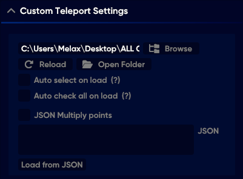

# 🔍 Các Câu Hỏi

**Tại sao mình không hiện menu ?**\
\- Nếu không hiện menu bạn hãy check lại xem mình có đang bật phần mềm overplay hiện thị thông số như MSIburner không , nếu có hãy tắt nó .\
\- ấn F1 để mở menu hoặc dấu \` theo file setting của mình.

**Tại sao mình lại bị xoá laucher khi vừa bật ?**\
\- Bạn hãy <mark style="color:orange;">\[Windows Security]</mark> - <mark style="color:orange;">\[Viruss & threat protection]</mark> phần <mark style="color:orange;">\[Viruss & threat protection settings]</mark> chọn <mark style="color:orange;">\[Manage settings]</mark> Tắt tất cả .\
**-** Vào <mark style="color:orange;">\[App & Bowser control]</mark> - chọn <mark style="color:orange;">\[Reputation based protection setting</mark>] - Tắt tất cả

**Làm cách nào để bật kill aura ?**\
\- Vào Setting bật chức năng nguy hiểm , sau khi bật nó sẽ hiện thị tại mục <mark style="color:orange;">\[Thế Giới]</mark>

**Làm cách nào để setup custom teleports ?**

1. Vào mục <mark style="color:orange;">\[TP tuỳ chỉnh]</mark> bên trái
2. Chọn phần <mark style="color:orange;">\[Tuỳ Chỉnh Dịch Chuyển]</mark>&#x20;
3. Chọn \[Kích Hoạt] - <mark style="color:orange;">\[Tự Dịch chuyển]</mark> (Thời gian để 5S cho máy mạnh , 10-20S cho người máy yếu)

<figure><figcaption>
Chọn biểu tượng này của Phần TP tuỳ chỉnh
</figcaption></figure>

Nó sẽ hiện ra bảng này

<figure><figcaption></figcaption></figure>

4. Nó sẽ hiện ra bảng <mark style="color:orange;">\[Cài đặt dịch chuyển tuỳ chỉnh]</mark> -  \[Chọn Bánh Răng] - \[mở thư mục]&#x20;
5. No sẽ tạo cho bạn 1 thư mục tên Teleports Việc cần làm của bạn bây giờ là Ra thư mục Chứa File teleports chọn thứ bạn muốn TP
6. Coppy toàn bộ File .json ( Đổi với những ai không thấy ) - vào Thư mục teleports\
   \+ ấn View - xuống phần show và chọn File name extension

<figure><figcaption></figcaption></figure>

<figure><figcaption></figcaption></figure>

7. Sau khi xong hãy vào game \[ bảng cài đặt tuỳ chỉnh dịch chuyển] - \[làm mới] - chọn \[tất cả] - ấn chọn để để nó bắt đầu&#x20;

<figure><figcaption></figcaption></figure>

Hoặc Xem video tại đây :


Đây là bản cũ nhưng sẽ làm giống như vậy


