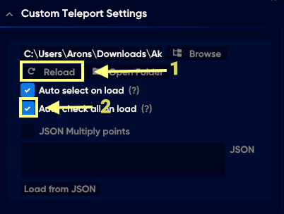
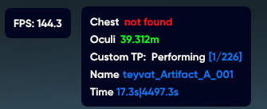

# 1️⃣ AKEBI

### Download File TP AKEBI

1. Go Link [Here](https://github.com/Thafoxes/Json_Integration/tree/upstream/eng-translate) Download File&#x20;
2. 
3. Extract File TP

<figure><figcaption></figcaption></figure>

### Settup Auto

> I will break it down step by step and each step will have 3 pictures to show.

1. Go to Funcion Teleports

<figure><figcaption>
Step 1
</figcaption></figure>

2. Follow the steps through pictures

<figure><figcaption>
Step 1
</figcaption></figure> <figure><figcaption>
Step 2
</figcaption></figure> <figure><figcaption>
Step 3
</figcaption></figure>

2. Follow the steps through pictures

> 5) After creating the teleports folder, remember that folder (if it doesn't exist, create it manually).
> 6) Find the file you need to teleport and use the key combination Ctrl + A (to select all files in the folder) Then press Ctrl + C (to copy the selected folder)
> 7) Go back to the teleports folder and use the key combination Ctrl + V to paste the copied files. ( After finishing, please re-enter the game. )

<figure><figcaption>
Step 5
</figcaption></figure> <figure><figcaption>
Step 6
</figcaption></figure> <figure><figcaption>
 Step 7
</figcaption></figure>

4. Follow the steps through pictures

> 8) Enable <mark style="color:red;">**Auto Sellect Load**</mark> then press Reload
> 9) Back to the board in **Step 3** , Click Select like Picture
> 10) Turn Off Menu , Enjoy

<figure><figcaption>
Step 8
</figcaption></figure> <figure><figcaption>
Step 9
</figcaption></figure> <figure><figcaption>
Step 10
</figcaption></figure>

### Or watch the video here :&#x20;



## Please watch the entire video to understand more about the function


