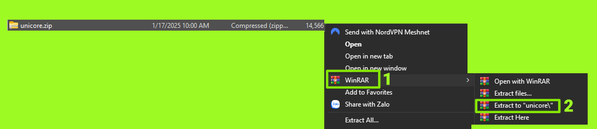
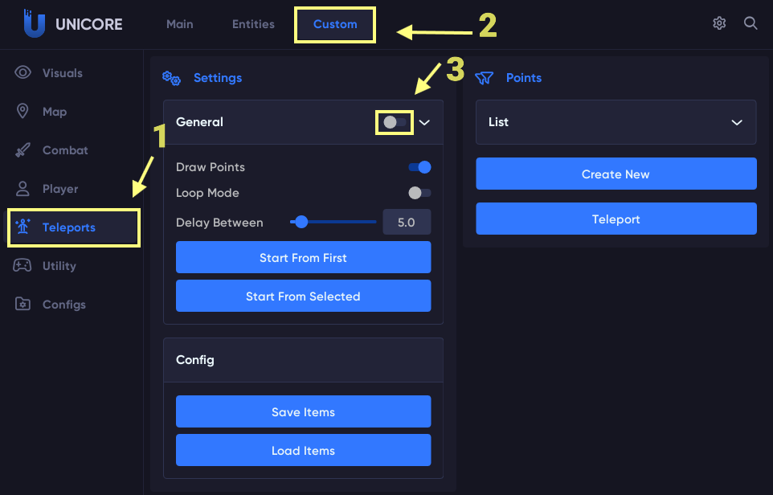
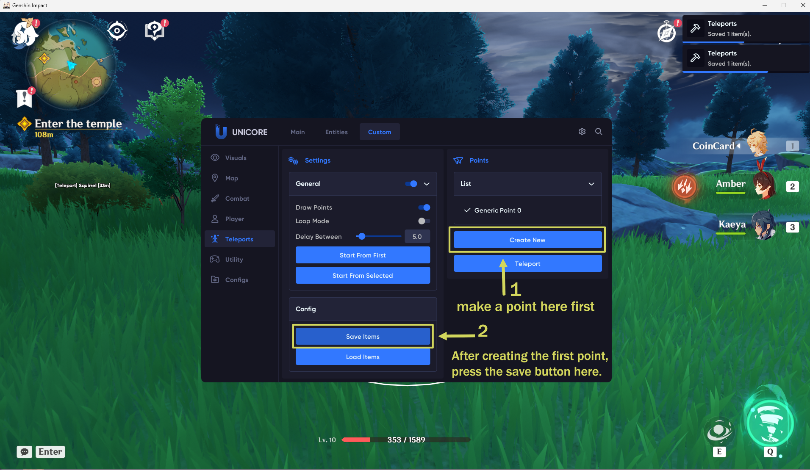
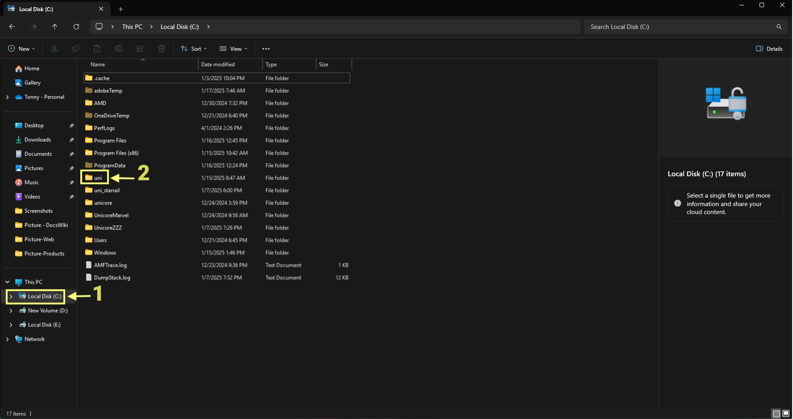
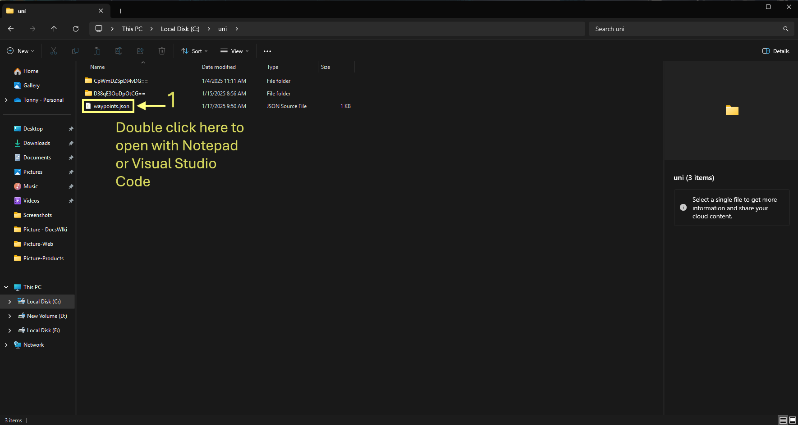
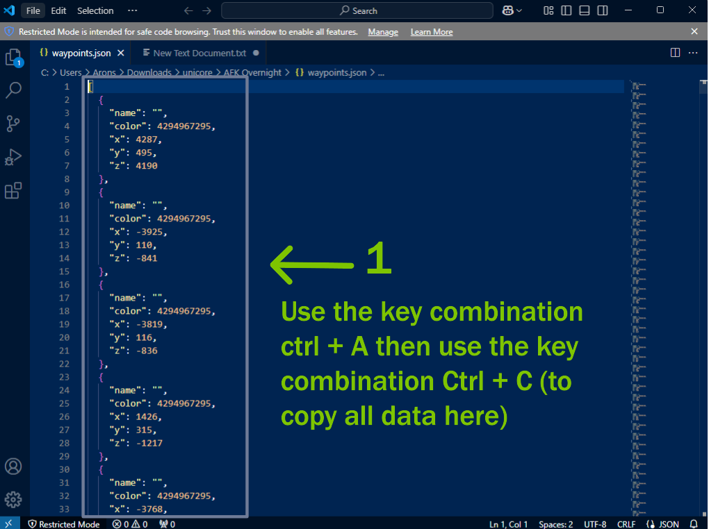
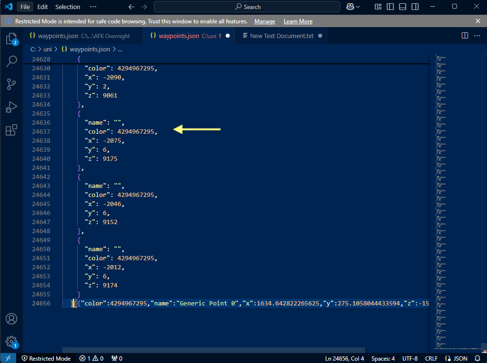
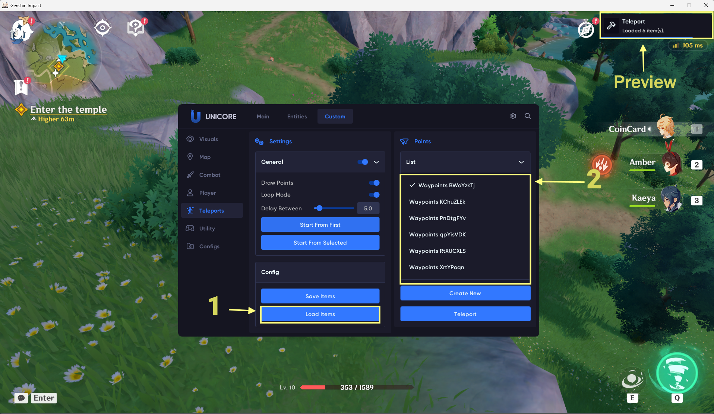

# 2️⃣ UNI EMPIRE

## How to use Config ?

## How to use Builder on visual ?

## How to use custom TP ?



### Download File TP

Download File TP [Here](https://github.com/Chinoontw/unicoreteleport/releases/tag/Unicore)

<figure><figcaption></figcaption></figure>

Extrar File&#x20;

<figure><figcaption></figcaption></figure>




### Settup Auto TP

> I will present the instructions in pictures and each row will have 3 pictures to avoid too many to distract and confuse the usage process.

1. Open Menu go on Path Teleports -> Custom -> General ( Enable )
2. First create a waypoint and then press Save Item to let Uni automatically create a folder named waypoints.json
3. Use Alt + Tab out of the screen and open Drive C you will see a file named <mark style="color:yellow;">**uni**</mark> open that folder

<figure><figcaption>
Step 1
</figcaption></figure> <figure><figcaption>
Step 2
</figcaption></figure> <figure><figcaption>
Step 3
</figcaption></figure>

> Follow these steps

4. Double click on File and open with <mark style="color:yellow;">**Notepad**</mark> or <mark style="color:yellow;">**Visual Studio Code**</mark>
5. Find the file you need to teleport&#x20;
6. Use the key combination <mark style="color:yellow;">**Ctrl + A**</mark> (_to select all files in the folder_) Then press <mark style="color:yellow;">**Ctrl + C**</mark> (_to copy the selected folder_)

<figure><figcaption>
Step 4
</figcaption></figure> <figure><figcaption>
Step 5
</figcaption></figure> <figure><figcaption>
Step 6
</figcaption></figure>

> Follow these steps

7. Go back to the File Waypoints.json and use the key combination Ctrl + V to paste the copied files. Use Ctrl+S Save File TP ( After finishing, please re-enter the game. )
8. Go back to the game and open the menu, select Load Items, the files will be updated at Points .&#x20;
9. Press Start Form Frist / Enjoy

<figure><figcaption>
Step 7
</figcaption></figure> <figure><figcaption>
Step 8
</figcaption></figure>




