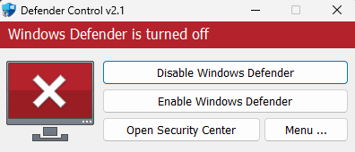
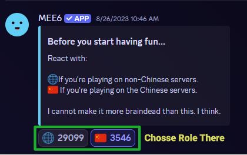
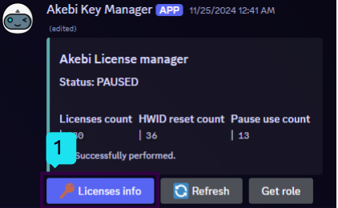
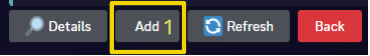
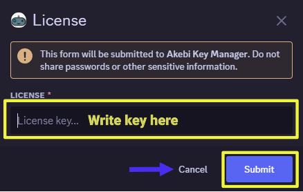
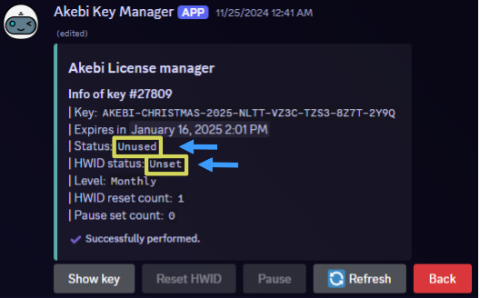
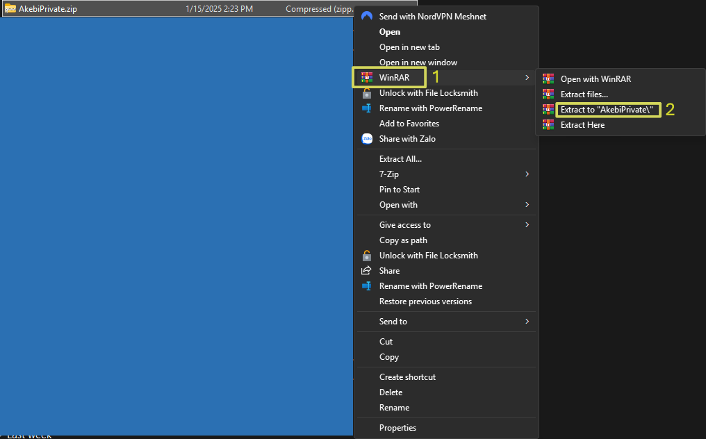
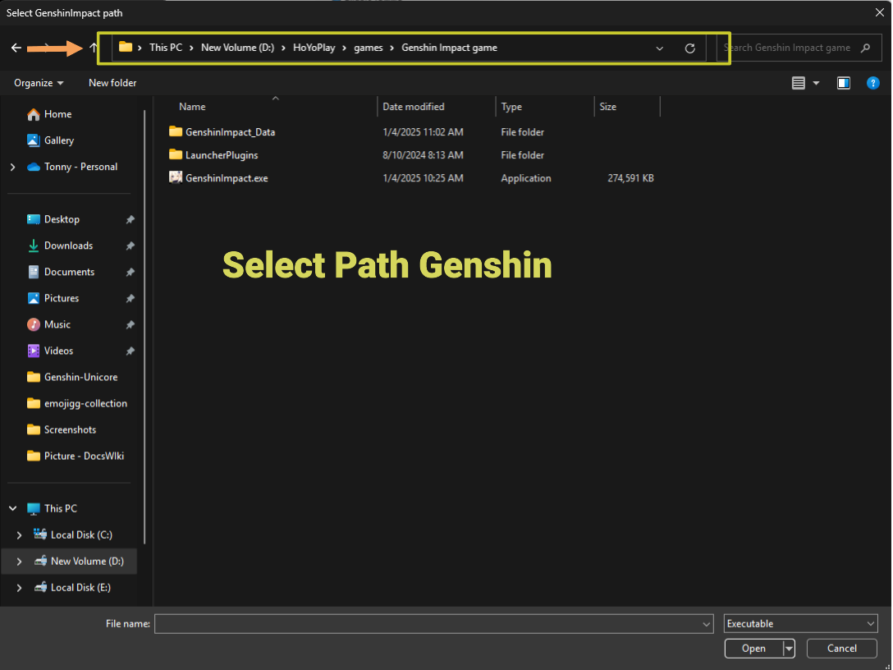
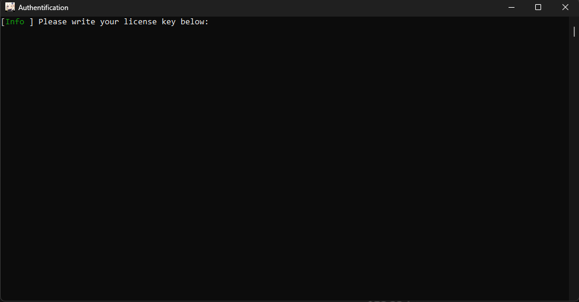

# 3️⃣ Akebi

## <mark style="color:yellow;">**Loader**</mark>

> **File** [**Akebi** ](http://akebi-private.com/uploads/AkebiPrivate.zip)
>
> **File** [**Akebilaucherinjectfix**](http://akebi-private.com/uploads/AkebiLauncherInjectionFix.zip)&#x20;

## <mark style="color:blue;">Settup Máy Tính Trước Khi Chạy</mark>

<div align="left"><figure><figcaption><p>Disable Windows Defender</p></figcaption></figure> <figure><figcaption><p>Step 1</p></figcaption></figure> <figure><figcaption><p>Step 2</p></figcaption></figure> <figure><figcaption><p>Step 3</p></figcaption></figure></div>

```
Install Driver 
Driectx : https://www.microsoft.com/en-us/download/details.aspx?id=35
NetWork : https://dotnet.microsoft.com/en-us/download/dotnet-framework
```

```
Remove & Disable Apps 
Disable Windows Defends Any Things 
2. Remove Third Antivirus , Or Anticheat 
3. Remove/Disable Overplay software
4. Remove/Disable Logitech GHUB , Razer Any Hub
4. Remove/Disable Reshader Any Mod 
```

## <mark style="color:yellow;">**INFORMATION**</mark>

<mark style="color:orange;">The key expiry date will only start running after entering the key into the tool. The key expiry date is calculated in real time and will always run whether you use it or not.</mark>

1. Once the key is entered into the tool, it will be attached to that computer. If you want to change the computer to use the key .
2. Key **1D** and **7D** : **1** Time change HWID <mark style="color:yellow;">(device)</mark> .
3. Key **30D** : **3** Time change HWID <mark style="color:yellow;">(device)</mark> and **1** Time pause key .&#x20;
4.  Select <mark style="color:yellow;">\[Details]</mark> - <mark style="color:yellow;">\[Enter key]</mark> - option show with you .

    (1) Show key <mark style="color:yellow;">\[Show key]</mark>

    (2) Reset HWID <mark style="color:yellow;">\[remove key from device in use]</mark>

    (3) Pause <mark style="color:yellow;">\[pause</mark> <mark style="color:yellow;">key, only for key 30D]</mark>



### <mark style="color:yellow;">**I.ADD KEY INTO BOT CHECK**</mark>

1. Bot : [Here](https://discord.com/channels/440536354544156683/1063808878556487710/1182320169926799410) ( Pls Remember Jhon Server AKB Firts and select Role )

<div align="left"><figure><figcaption><p>Select Role</p></figcaption></figure> <figure><figcaption><p>Step 1</p></figcaption></figure> <figure><figcaption><p>Step 2</p></figcaption></figure> <figure><figcaption><p>Step 3</p></figcaption></figure> <figure><figcaption><p>Step 4</p></figcaption></figure> <figure><figcaption><p>Done</p></figcaption></figure></div>



### <mark style="color:yellow;">**II.RUNNING INSTRUCTIONS**</mark>

1. Download File ,Winrar Extract to \[AkebiPrivate] and run \[Akebilaucher.exe] , select path \[GenshinImpact.exe] .

<div align="left"><figure><figcaption><p>Step 1</p></figcaption></figure> <figure><figcaption><p>Step 2</p></figcaption></figure> <figure><figcaption><p>Step 3</p></figcaption></figure></div>

2. Right-click on the Genshin game on the desktop and select \[open file location] - Scroll up and click on the \[Genshin Impact game] folder. The file \[GenshinImpact.exe] will be there (this is a guide for those who don't know how to use the link of where is the game?)
3. Wait a 5-10s, it will appear on the CMD panel, Enter key . <mark style="color:blue;">\[key has the form: AKEBI-xDay-FULL-XXXX-XXXX...]</mark> .
4. Wait 5s-10s the game will open automatically. When you get to the login screen, **DO NOT CLICK ON THE GAME**.
5. IF you see CMD show console wait 5s after CMD is disabled press **`F1`** .



### <mark style="color:yellow;">**Video Guide :**</mark>&#x20;


