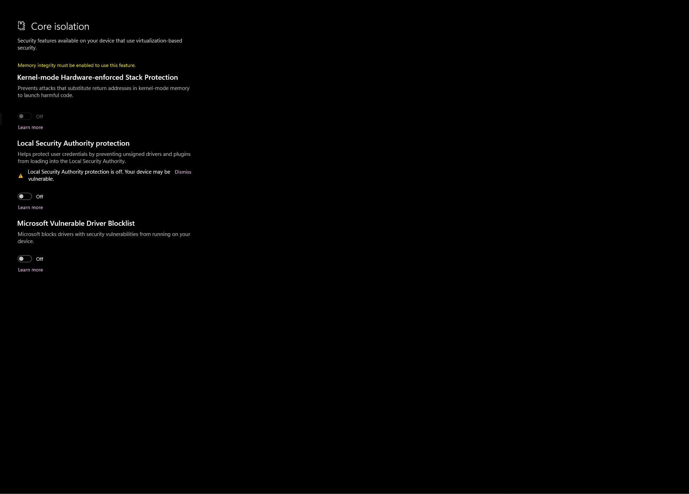

# 2️⃣ Uni Empire


Loader




For All Products Uni




Defender Control


## Setup Computer Before Running

<div align="left"><figure><figcaption><p>Disable Windows Defender</p></figcaption></figure> <figure><figcaption><p>Step 1</p></figcaption></figure> <figure><figcaption><p>Step 2</p></figcaption></figure> <figure><figcaption><p>Step 3</p></figcaption></figure></div>

```
Install Driver 
Driectx : https://www.microsoft.com/en-us/download/details.aspx?id=35
NetWork : https://dotnet.microsoft.com/en-us/download/dotnet-framework
```

```
Remove & Disable Apps 
Disable Windows Defends Any Things 
2. Remove Third Antivirus , Or Anticheat 
3. Remove/Disable Overplay software
4. Remove/Disable Logitech GHUB , Razer Any Hub
4. Remove/Disable Reshader Any Mod 
```

## `I.`**`General Start-Up Steps`**

* Make sure windows security software is turned off.
* Run our software strictly BEFORE opening the game.
* Try restarting your computer before opening Loader.

> <mark style="color:orange;">**->**</mark>**`Uniwase` (&#x20;**<mark style="color:red;">**IMPORTANT**</mark> : DELETE Wuthering Waves\Wuthering Waves Game\Engine\Plugins\Runtime\Nvidia\Streamline **)**
>
> <mark style="color:orange;">**->**</mark>**`Unirivals` (&#x20;**<mark style="color:red;">**IMPORTANT**</mark> : Delete **STEAMLINE** folder located at - SteamLibrary\steamapps\common\MarvelRivals\MarvelGame\Engine\Plugins\Marketplac&#x65;**)**



### Inject Loader

1. Turn on Loader with administrator
2. Enter Key into Loader
3. Press Start Load
4. Login Game&#x20;



### Load Menu

1. Press **`F2`** On the keyboard to open the Menu or use **`FN+F2`**&#x20;
2. Press **`Insert`** On the keyboard to turn on/off the Menu / For Fivem/RageMp use **`F6`**


