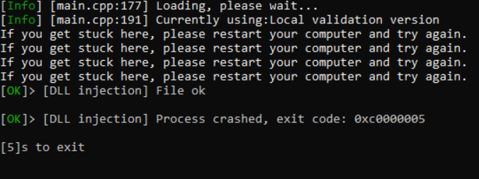

# ⚙️ PROBLEMS

## <mark style="color:blue;">**Genshin Impact bugs / issues manual**</mark>

No injection at all / no sound effect on <mark style="color:blue;">**F2**</mark> click.\
**1.** Open Windows Core Isolation settings  <mark style="color:blue;">(can be found in Windows Securite folder)</mark>\
**2.** Turn off the core isolation feature\
 (1).png>)\
**3.** Disable all external anticheats on your PC such as <mark style="color:blue;">**"Vanguard", "EAC", "Ricochet"**</mark>.\
**4.** Download the following files and install:\
[https://www.microsoft.com/en-us/download/details.aspx?id=35](https://www.microsoft.com/en-us/download/details.aspx?id=35)\
[https://dotnet.microsoft.com/en-us/download/dotnet-framework](https://dotnet.microsoft.com/en-us/download/dotnet-framework)\
5\. Remove Anti-Virus Software: <mark style="color:blue;">**"Kaspersky" / "Avast" / "Avira"/ "360 total secure"/ etc**</mark>. You need to fully remove antivirus if having this issue.\
**6.** Restart your PC and try again.\
\
Make sure that these programs arent installed:

NVIDIA in-game overlay :  GeForce Experience

RTSS / RivaTuner (Performance Stats Overlay, this may be bundled with MSI Afterburner)

More Anti-Virus:

Avast / Norton / Kaspersky (Anti-Virus Software)

Anti Che..s:

FACEIT / ESEA / CEVO Clients (CS:GO League Anti-Che..s)

Valorants Anti Che..:

Vanguard (Valorant Anti-Che.. | [https://support-valorant.riotgames.com/hc/en-us/articles/360044648213-Uninstalling-and-Disabling-Riot-Vanguard](https://support-valorant.riotgames.com/hc/en-us/articles/360044648213-Uninstalling-and-Disabling-Riot-Vanguard))\

### <mark style="color:blue;">**Blue Screen error.**</mark>

 (1).png>)

Blue Screen (BSOD) may happen due to driver injection failure.\
Restart your PC and try again in case if the "Blue Screen" error happen 5 times in a row - please follow next steps:\
**1.** Disable / remove antivirus from your PC (any protection services)\
**2.** Go to the C:/windows/minidump folder and send 3 latest minidump files from this folder to the technical administrator.\
**3.** Windows reinstall.\

### <mark style="color:blue;">**Unable to install exploit driver.**</mark>   (1).png>)

The “<mark style="color:blue;">Unable to install exploit driver</mark>” error usually occurs due to the presence of an anti-cheat/anti-virus on the PC. Most of the time it happen due to Riot's Vanguard anticheat (league of legends / valorant). Please follow next steps:\
**1.** Remove all external protection software from your PC.\
**2.** DISABLE / FULLY REMOVE: Ricochet anticheat / Valorant anticheat in case if you have it.\
**3.** Disable / FULLY REMOVE: FACEIT / ESEA / CEVO Clients (CS:GO League Anti-Che..s)\
**4.** Download Process hacker 2.\
**5.** Check the active processes, look for the any enabled protection / security services. Disable it in case if you find it.\
**6.** Double click on "System"

 (1).png>)\
**7.** Open "Modules" location\
 (1).png>)

**8.** Search for Anticheat / Antivirus / Protection modules and unload it.\

Internal server error\
 (1).png>)
--------------------------------------------

* It means that web server is currently offline and you need to wait till it back up.

### An Exception :

<figure><figcaption></figcaption></figure>

giữ phím <mark style="color:yellow;">\[ H ]</mark> sau đó mở Loader nó sẽ hiện bản như sau :&#x20;

<figure><figcaption></figcaption></figure>

Sau đó ấn Continue chọn server Hongkong - Ấn No và vào mở lại Loader

### <mark style="color:blue;">**HONKAI STARRAIL**</mark> <mark style="color:blue;"></mark><mark style="color:blue;">Common Error</mark>&#x20;

* error 2010 before battle > turn off speed up dialog \
  \-Speed ​​battle screen freezes&#x20;
* Speed battle ​​x5 => when you encounter an enemy in the photo, turn off speed battle

&#x20; (1).png>)

ERROR 403 :\
.png>)
----------------------------------------

Go my server : [Click](https://discord.com/channels/1104940962804936856/1181413007415332914)&#x20;

Create Ticket : .png>)

1. Write down the cpu + vga information you are using&#x20;
2. And Key \[SDHJK-XXXXX-XXXXX]
3. Please wait 5-15 minutes I will verify if it matches I will change the HWID for you

## Fix 0xf702f33c & Fatal Error!

.png>)\
Disable Antimalware&#x20;


